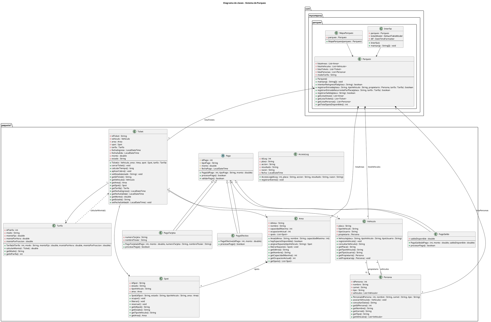

# Manual del Desarrollador – Sistema de Parqueo
## Estilo developer–friendly 

---

## Índice

1. Introducción  
2. Arquitectura general  
3. Clases principales  
   - Parqueo  
   - Interfaz  
   - MapaParqueo  
   - AccessLog  
   - Area  
   - Spot  
   - Persona  
   - Vehiculo  
   - Tarifa  
   - Ticket  
   - Pago, PagoEfectivo, PagoSaldo, PagoTarjeta  
4. Explicación método por método (resumen técnico)  
5. Diagrama UML completo  

---

# 1. Introducción

Este manual describe de manera detallada y extendida cómo funciona mi **Sistema de Parqueo** hecho en Java con Swing.  
Lo escribo como si fuera una guía para mí mismo en el futuro y para cualquier desarrollador que tenga que mantener o mejorar este proyecto.

El objetivo principal del sistema es simular el funcionamiento de un parqueo universitario con:

- Entrada y salida de vehículos  
- Manejo de **tarifas FLAT y VARIABLE**  
- Reingreso gratuito por tiempo limitado para FLAT  
- Asignación automática de áreas según tipo de usuario y vehículo  
- Manejo de spots individuales  
- Visualización gráfica del parqueo  
- Exportación e importación de tickets mediante archivos CSV  

La idea del manual es evitar tener que leer todo el código crudo cuando quiera recordar cómo funciona algo.  
Aquí explico:

- Qué representa cada clase  
- Qué hace cada método  
- Cómo se relacionan las partes entre sí  
- Por qué tomé ciertas decisiones de diseño  

---

## 1.1 Propósito del sistema

El sistema intenta modelar de forma realista cómo funciona un parqueo en una universidad:

- Los estudiantes y catedráticos tienen áreas distintas.  
- Las motos no se mezclan con autos.  
- Hay una cantidad limitada de espacios por área.  
- Los usuarios con tarifa FLAT pueden entrar y salir sin pagar de nuevo dentro de cierto tiempo.  
- Cada entrada y salida genera un **ticket** con fecha, hora y monto calculado.  

No es solo un CRUD de vehículos; es una simulación sencilla pero lógica del flujo real de un parqueo.

---

## 1.2 Público objetivo

Este manual está pensado para:

- **Yo mismo en el futuro** que ya no recuerde nada del código.  
- Cualquier **compañero o profesor** que quiera entender la arquitectura.  
- Cualquier otro **desarrollador** que quiera extender el sistema.

---

## 1.3 Tecnologías usadas

- **Java 17+**  
- **Swing** para la interfaz gráfica  
- Colecciones de Java (`List`, `ArrayList`)  
- API de fechas `java.time` (`LocalDateTime`, `Duration`)  
- Lectura y escritura de archivos (`FileWriter`, `BufferedReader`, etc.)  

---

# 2. Arquitectura general

A nivel alto, el sistema se divide en dos capas bien separadas:

1. **Lógica del negocio (modelo)**  
2. **Interfaz gráfica (UI)**  

La idea es que la interfaz se encargue de mostrar cosas y pedir datos, y la lógica tome todas las decisiones importantes.

---

## 2.1 Capa de negocio (modelo)

Esta capa está formada por las clases:

- `Parqueo` (núcleo del sistema)  
- `Area`  
- `Spot`  
- `Persona`  
- `Vehiculo`  
- `Tarifa`  
- `Ticket`  
- `AccessLog`  
- `Pago` y sus subclases (`PagoEfectivo`, `PagoSaldo`, `PagoTarjeta`)  

Aquí vive la lógica de:

- Asignar áreas automáticamente  
- Buscar spots disponibles  
- Registrar tickets  
- Calcular tiempos y montos  
- Manejar reservas FLAT  
- Asociar personas con vehículos  

La clase **Parqueo** es la que coordina todo.  
Las demás clases representan conceptos del mundo real.

---

## 2.2 Capa de interfaz de usuario (UI)

La capa gráfica está compuesta por:

- `Interfaz` → ventana principal del sistema  
- `MapaParqueo` → ventana que muestra el estado gráfico de todos los spots  

La UI:

- Captura lo que el usuario escribe  
- Llama a métodos de la clase `Parqueo`  
- Muestra resultados en tablas y paneles  

La UI **no calcula montos ni decide reglas del parqueo**.  
Todo eso se delega al modelo.

---

## 2.3 Responsabilidades por capa

### Modelo

- Gestionar listas maestras de áreas, personas, vehículos y tickets.  
- Encargarse de las reglas de negocio, como:
  - “dónde estaciona una moto”  
  - “cómo se cobra una tarifa VARIABLE”  
  - “cuándo empieza y termina una reserva FLAT”  

### UI

- Pedir placa, nombre, carnet, método de pago y tipo de tarifa.  
- Mostrar mensajes de éxito o error.  
- Actualizar la tabla de tickets.  
- Mostrar el mapa de spots codificado por colores.

---

# 3. Clases principales

En esta sección explico cada clase, qué representa y qué hace.

---

## 3.1 Clase `Parqueo` (núcleo del sistema)

La clase `Parqueo` es el corazón del sistema.  
Aquí guardo y gestiono toda la información del parqueo.

### Atributos

```java
private List<Area> listaAreas = new ArrayList<>();
private List<Vehiculo> listaVehiculos = new ArrayList<>();
private List<Ticket> listaTickets = new ArrayList<>();
private List<Persona> listaPersonas = new ArrayList<>();
private String modoTarifa = "Variable";
```

- **listaAreas**: contiene todas las áreas del parqueo (Motos, Docentes, Estudiantes).  
- **listaVehiculos**: historial de vehículos conocidos (por placa).  
- **listaTickets**: todos los tickets, activos y cerrados.  
- **listaPersonas**: todas las personas registradas (asociadas por carnet).  
- **modoTarifa**: valor global de modo, actualmente solo informativo.

### Constructor

```java
public Parqueo() {
    listaAreas.add(new Area("A", "Motos", 40));
    listaAreas.add(new Area("B", "Docentes", 40));
    listaAreas.add(new Area("C", "Estudiantes", 40));
}
```

Al iniciar el sistema:

- Creo 3 áreas con 40 espacios cada una.  
- Cada área genera sus `Spot` internamente.

### Métodos clave (a nivel de diseño)

- `limpiarReservasExpiradas()`  
- `intentarReingresoFlat(String placa)`  
- `registrarEntrada(...)`  
- `registrarEntradaRecurrentePorPlaca(...)`  
- `registrarSalida(String placa)`  
- `getTotalSpotsDisponibles()`  
- Búsqueda de personas, vehículos, tickets y áreas.  
- `seleccionarAreaPara(Vehiculo v)` para decidir la zona automáticamente.

---

## 3.2 Clase `Interfaz` (ventana principal)

La clase `Interfaz` es una subclase de `JFrame`.  
Aquí se construyen:

- Los campos de texto para placa, nombre, carnet.  
- Los combos para tipo de usuario (ESTUDIANTE/CATEDRATICO) y tipo de vehículo (Auto/Moto).  
- Los botones:
  - Registrar Entrada  
  - Registrar (rápido)  
  - Registrar Salida  
  - Refrescar Tickets  
  - Guardar (CSV)  
  - Cargar (CSV)  
  - Mapa  

La `Interfaz` tiene una instancia de `Parqueo`:

```java
private Parqueo parqueo;
```

Y maneja un `DefaultTableModel` conectado al `JTable` de tickets:

```java
private DefaultTableModel ticketModel;
```

Cada acción del usuario se traduce en llamadas a métodos de `Parqueo` y actualizaciones visuales.

---

## 3.3 Clase `MapaParqueo`

`MapaParqueo` también extiende `JFrame`.  
Su trabajo es **mostrar gráficamente** todos los spots de cada área.

- Usa un `GridLayout(1, 3)` para mostrar una columna por área.  
- Dentro de cada panel de área, recorre la lista de `Spot` y dibuja un `JButton` por spot.  
- El color del botón depende del estado del spot:
  - Verde → `FREE`  
  - Rojo → `OCUPADO`  
  - Naranja → `RESERVADO`  

Esto da una vista rápida del estado del parqueo.

---

## 3.4 Clase `AccessLog`

Representa un registro simple de eventos del parqueo.  
Actualmente solo imprime en consola los datos del evento.

### Atributos

- `idLog`  
- `placa`  
- `accion` (ej. “ENTRADA” / “SALIDA”)  
- `resultado` (ej. “OK” / “ERROR”)  
- `razon` (detalle adicional)  
- `fecha` (LocalDateTime)

Es una clase lista para en un futuro guardar logs en archivo o BD.

---

## 3.5 Clase `Area`

Representa una zona del parqueo: por ejemplo, “Motos”, “Docentes” o “Estudiantes”.

### Atributos

- `idArea` (A, B, C, etc.)  
- `nombre` (“Motos”, “Docentes”, etc.)  
- `capacidadMaxima` (ej. 40)  
- `ocupacionActual`  
- `spots` → lista de `Spot`

En el constructor, según el nombre, asigno el tipo de vehículo por defecto:

- Si el área se llama “Motos” → genero spots para “Moto”.  
- En otras áreas → genero spots para “Auto”.

### Métodos importantes

- `hayEspacioDisponible()` → indica si queda algún spot libre.  
- `asignarEspacio(String tipoVehiculo)` → busca un spot compatible y lo ocupa.  
- `liberarEspacio(Spot s)` → libera un spot ocupado y ajusta la ocupación.

---

## 3.6 Clase `Spot`

Un `Spot` representa un espacio físico específico: A-1, B-10, C-25, etc.

### Atributos

- `idSpot` → texto como "A-1".  
- `estado` → `"FREE"`, `"OCUPADO"` o `"RESERVADO"`.  
- `tipoVehiculo` → `"Auto"` o `"Moto"`.  
- `area` → referencia al área a la que pertenece.

### Métodos

- `ocupar()` → marca el spot como `"OCUPADO"`.  
- `liberar()` → marca el spot como `"FREE"`.  
- `reservar()` → marca el spot como `"RESERVADO"` (usado en tickets FLAT).

---

## 3.7 Clase `Persona`

Modela a una persona usuaria del parqueo (estudiante o catedrático).

### Atributos

- `idPersona` → ID interno.  
- `nombre`  
- `carnet`  
- `tipo` → `"ESTUDIANTE"` o `"CATEDRATICO"`.  
- `vehiculos` → lista de vehículos asociados a esa persona.

### Métodos

- `asociarVehiculo(Vehiculo v)` → vincula el vehículo a la persona y asigna el propietario en el vehículo.  
- `consultarDatos()` → devuelve un resumen tipo `String`.  
- Getters para todos sus datos.

---

## 3.8 Clase `Vehiculo`

Representa un vehículo con su placa e información relacionada.

### Atributos

- `placa`  
- `tipoVehiculo` → `"Auto"` / `"Moto"`  
- `tipoUsuario` → copiado del tipo de persona (“ESTUDIANTE”, “CATEDRATICO”)  
- `propietario` → referencia a `Persona`

### Métodos

- `consultarVehiculo()` → devuelve un resumen `String`.  
- Getters para placa, tipo, tipoUsuario y propietario.  
- `setPropietario(Persona p)` → para vincular la persona.

---

## 3.9 Clase `Tarifa`

Esta clase encapsula la forma de calcular cuánto debe pagar un ticket.

### Atributos

- `idTarifa`  
- `modo` → `"FLAT"` o `"VARIABLE"`  
- `montoFijo`  
- `montoPorHora`  
- `montoPorFraccion` (reservado para futuras extensiones)

### Método clave

- `calcularMonto(Ticket t)`:  
  - Si `modo` es `"FLAT"` → siempre devuelve `montoFijo`.  
  - Si es `"VARIABLE"` → calcula el tiempo en minutos a partir del ticket y lo convierte a horas (double), luego multiplica por `montoPorHora`.

---

## 3.10 Clase `Ticket`

El `Ticket` representa la relación entre:

- un vehículo  
- un área  
- un spot  
- una tarifa  
- un intervalo de tiempo (entrada – salida)  

### Atributos principales

- `idTicket` → generado con `UUID.randomUUID().toString()`.  
- `vehiculo`  
- `area`  
- `spot`  
- `tarifa`  
- `fechaIngreso`  
- `fechaSalida` (null mientras está activo)  
- `monto`  
- `estado` → `"ACTIVO"`, `"CERRADO"` o `"FLAT_RESERVADO"`.

### Estados y comportamiento

- Cuando se crea un ticket → `estado = "ACTIVO"`.  
- Cuando se llama `cerrarTicket()`:
  - Si tarifa es FLAT:
    - Se calcula el monto.
    - Se marca `estado = "FLAT_RESERVADO"`.
    - El spot se marca como `RESERVADO` (sigue separado para el mismo vehículo, por 2 horas).
  - Si tarifa es VARIABLE:
    - Se calcula el monto.
    - Se marca `estado = "CERRADO"`.
    - Se libera el spot en el área.

### Métodos relevantes

- `cerrarTicket()`: cierra el ticket respetando las reglas de la tarifa.  
- `calcularTiempo()`: devuelve los minutos transcurridos entre ingreso y salida (o ahora si aún no hay salida).  
- `aplicarCobro()`: recalcula el monto usando la tarifa.  
- Setters y getters para todos los campos importantes.

---

## 3.11 Clases `Pago`, `PagoEfectivo`, `PagoSaldo`, `PagoTarjeta`

Estas clases forman un pequeño modelo de pagos:

- `Pago` es abstracta y define:
  - `idPago`, `tipoPago`, `monto`, `fechaPago`.  
  - `procesarPago()` (abstracto).  
  - `validarPago()` (revisa que el monto sea mayor que 0).

- `PagoEfectivo`:
  - Procesa el pago devolviendo `true` si el monto es válido.

- `PagoSaldo`:
  - Recibe un saldo disponible.
  - Solo procesa el pago si el saldo es suficiente.

- `PagoTarjeta`:
  - Simula un pago con tarjeta: solo valida que el número no sea null y que el monto sea válido.

Actualmente estas clases todavía no están integradas completamente al registro del ticket, pero la arquitectura ya está preparada para eso.

---

# 4. Explicación método por método (resumen técnico)

En esta sección dejo un resumen técnico de los métodos más importantes.  
No repito palabra por palabra todo, pero sí suficiente para entender la intención de cada uno.

---

## 4.1 Métodos de `Parqueo`

- `main(String[] args)`  
  Lanza la interfaz gráfica en el hilo de eventos de Swing.

- `limpiarReservasExpiradas()`  
  Recorre la lista de tickets, busca los que están en estado `"FLAT_RESERVADO"` y verifica si ya pasó el tiempo de reserva (120 minutos).  
  Si ya se venció, libera el spot y marca el ticket como `"CERRADO"`.

- `intentarReingresoFlat(String placa)`  
  Lógica de reingreso especial para tarifa FLAT:
  - Revisa los tickets anteriores del vehículo.
  - Si el último ticket FLAT está dentro de la ventana de reingreso, cambia su estado a `"ACTIVO"` y vuelve a ocupar su spot.  
  - Devuelve `true` si se permitió el reingreso, `false` si no.

- `registrarEntrada(String placa, String tipoVehiculo, Persona propietario, Tarifa tarifa)`  
  Flujo de entrada normal (datos completos):
  1. Reutiliza persona por carnet si ya existe.  
  2. Reutiliza vehículo por placa si ya existe, o lo crea si no.  
  3. Asocia persona y vehículo.  
  4. Escoge el área adecuada con `seleccionarAreaPara(v)`.  
  5. Pide un spot con `asignarEspacio`.  
  6. Crea un ticket nuevo y lo agrega a la lista.

- `registrarEntradaRecurrentePorPlaca(String placa, Tarifa tarifa)`  
  Entrada para vehículos ya conocidos solo por placa.  
  Sigue el mismo flujo que la entrada normal pero no crea persona ni vehículo nuevos.

- `registrarSalida(String placa)`  
  Localiza el ticket activo para la placa dada y llama `cerrarTicket()` sobre él.  
  Luego devuelve `true` si lo encontró y procesó correctamente.

- `getTotalSpotsDisponibles()`  
  Suma la diferencia entre capacidad máxima y ocupación actual en todas las áreas.

- `findPersonaByCarnet(String carnet)`  
  Busca en `listaPersonas` una persona con ese carnet (ignorando mayúsculas/minúsculas).

- `findVehiculoByPlaca(String placa)`  
  Busca en `listaVehiculos` un vehículo con esa placa.

- `findActiveTicketByPlaca(String placa)`  
  Busca en la lista de tickets un ticket cuyo vehículo tenga esa placa y su estado sea `"ACTIVO"`.

- `findAreaByNombre(String nombreArea)`  
  Busca un área cuyo `nombre` coincida (ignorando mayúsculas/minúsculas).

- `seleccionarAreaPara(Vehiculo v)`  
  Reglas del sistema:
  - Si el tipo de vehículo es `"Moto"` → área “Motos”.  
  - Si el tipo de usuario es `"CATEDRATICO"` → área “Docentes”.  
  - En cualquier otro caso → área “Estudiantes”.

---

## 4.2 Métodos de `Interfaz`

- `Interfaz()` (constructor)  
  Inicializa los componentes Swing, crea una instancia de `Parqueo`, prepara el `DefaultTableModel` de la tabla y ajusta combos de tipo de usuario y vehículo. También posiciona la ventana y llama a `refrescarTabla()`.

- `pedirDatosDePagoYTarifa()`  
  Abre un `JOptionPane` con un panel que contiene:
  - Combo de método de pago (EFECTIVO, TARJETA, SALDO).  
  - Combo de tipo de tarifa (VARIABLE, FLAT).  
  Devuelve un arreglo `String[]` con ambos valores o `null` si el usuario cancela.

- `refrescarTabla()`  
  Borra las filas actuales del `ticketModel` y vuelve a recorrer todos los tickets de `parqueo`, extrayendo sus datos y volcándolos a la tabla.

- `actualizarSpots()`  
  Llama a `parqueo.getTotalSpotsDisponibles()` y actualiza la etiqueta `lblSpots`.

- Handlers de botones:
  - `btnRegistrarRapidoActionPerformed(...)`  
    Toma los datos del formulario principal (placa, nombre, carnet, tipo de usuario, tipo de vehículo).  
    Pide método de pago y tipo de tarifa.  
    Crea una `Persona`, una `Tarifa` y llama a `parqueo.registrarEntrada(...)`.  
    Limpia el formulario y refresca la tabla y los spots.

  - `btnEntradaActionPerformed(...)`  
    Pide únicamente la placa por `JOptionPane`.  
    Primero intenta `parqueo.intentarReingresoFlat(placa)`.  
    Si no aplica reingreso FLAT:
      - Solicita método de pago y tarifa.  
      - Llama a `registrarEntradaRecurrentePorPlaca`.

  - `btnSalidaActionPerformed(...)`  
    Pide placa, llama a `parqueo.registrarSalida(placa)`, refresca la tabla y los spots.

  - `btnRefrescarActionPerformed(...)`  
    Llama a `refrescarTabla()` y actualiza el mensaje de estado.

  - `btnGuardarActionPerformed(...)`  
    Abre un `JFileChooser` para elegir dónde guardar.  
    Escribe encabezado CSV y luego recorre los tickets, exportando sus datos.

  - `btnCargarActionPerformed(...)`  
    Abre un `JFileChooser` para elegir un CSV.  
    Lee el archivo línea por línea, separa por comas y llena el `ticketModel` con esos valores.

  - `btnMapaActionPerformed(...)`  
    Crea un nuevo `MapaParqueo(parqueo)` y lo muestra.

---

## 4.3 Métodos de `MapaParqueo`

- `MapaParqueo(Parqueo parqueo)`  
  Configura la ventana, tamaño, título, cierre, y recorre las áreas del parqueo añadiendo un panel por cada una.

- `crearPanelArea(Area area)`  
  Crea un panel con borde titulado con el nombre del área.  
  Dentro, genera un botón por cada `Spot`.  
  Cada botón muestra ID, tipo de vehículo y estado, y se pinta:
  - Verde si está `"FREE"`  
  - Rojo si está `"OCUPADO"`  
  - Naranja si está reservado (por FLAT)

---

## 4.4 Métodos de `Area`

- `Area(String idArea, String nombre, int capacidadMaxima)`  
  Constructor que inicializa los atributos, decide el tipo de vehículo por defecto según el nombre y genera la lista de `Spot` con IDs como `"A-1"`, `"A-2"`, …, `"A-n"`.

- `hayEspacioDisponible()`  
  Devuelve `true` si `ocupacionActual < capacidadMaxima`.

- `asignarEspacio(String tipoVehiculo)`  
  Recorre la lista de spots y devuelve el primero que:
  - esté `"FREE"` y  
  - acepte ese tipo de vehículo (o tipo `"ALL"` si existiera).  
  Ocupa el spot y aumenta la ocupación.

- `liberarEspacio(Spot s)`  
  Verifica que el spot esté ocupado, lo libera y decrementa la ocupación (sin permitir valores negativos).

---

## 4.5 Métodos de `Spot`

- `ocupar()`  
  `estado = "OCUPADO"`.

- `liberar()`  
  `estado = "FREE"`.

- `reservar()`  
  `estado = "RESERVADO"`.

---

## 4.6 Métodos de `Persona`

- `asociarVehiculo(Vehiculo v)`  
  Si el vehículo no es nulo y no está en la lista, lo agrega y le dice al vehículo que su propietario es esta persona.

- `consultarDatos()`  
  Devuelve un `String` con formato:  
  `"Persona[id=..., nombre=..., carnet=..., tipo=..., vehiculos=N]"`.

---

## 4.7 Métodos de `Vehiculo`

- `consultarVehiculo()`  
  Devuelve un `String` tipo:  
  `"Vehiculo[placa=..., tipo=..., usuario=...]"`.

- `setPropietario(Persona p)`  
  Establece el vínculo con la persona que es dueña del vehículo.

---

## 4.8 Métodos de `Tarifa`

- `calcularMonto(Ticket t)`  
  - Si `t.getFechaSalida()` es `null`, devuelve 0.  
  - Si `modo` es `"FLAT"`, devuelve `montoFijo`.  
  - Si es `"VARIABLE"`, toma los minutos del ticket (`t.calcularTiempo()`), lo convierte a horas (`minutos / 60.0`) y retorna `montoPorHora * horas`.

---

## 4.9 Métodos de `Ticket`

- `Ticket(Vehiculo v, Area area, Spot spot, Tarifa tarifa)`  
  Constructor que:
  - Genera un `UUID` como `idTicket`.  
  - Asigna vehículo, área, spot y tarifa.  
  - Marca `fechaIngreso = LocalDateTime.now()`.  
  - `estado = "ACTIVO"`.

- `cerrarTicket()`  
  - Marca `fechaSalida = LocalDateTime.now()`.  
  - Calcula monto con `tarifa.calcularMonto(this)`.  
  - Si la tarifa es FLAT:
    - `estado = "FLAT_RESERVADO"`.  
    - Marca el spot como `RESERVADO`.  
  - Si la tarifa es VARIABLE:
    - `estado = "CERRADO"`.  
    - Libera el spot a través del área.

- `calcularTiempo()`  
  Toma la `fechaIngreso` y la `fechaSalida` (o `now` si aún no ha salido) y devuelve minutos transcurridos con `Duration.between(...)`.

- `aplicarCobro()`  
  Recalcula el monto usando la tarifa y marca el estado `"PAGADO"`.

---

# 5. Diagrama UML completo

A continuación incluyo el diagrama UML del sistema en formato PlantUML, tal como lo diseñé para representar todas las clases y sus relaciones.



---

Fin del manual.
